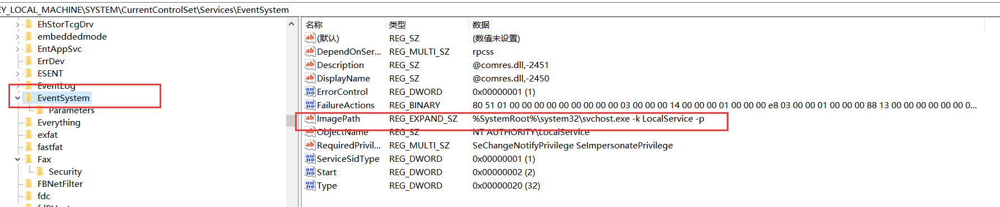
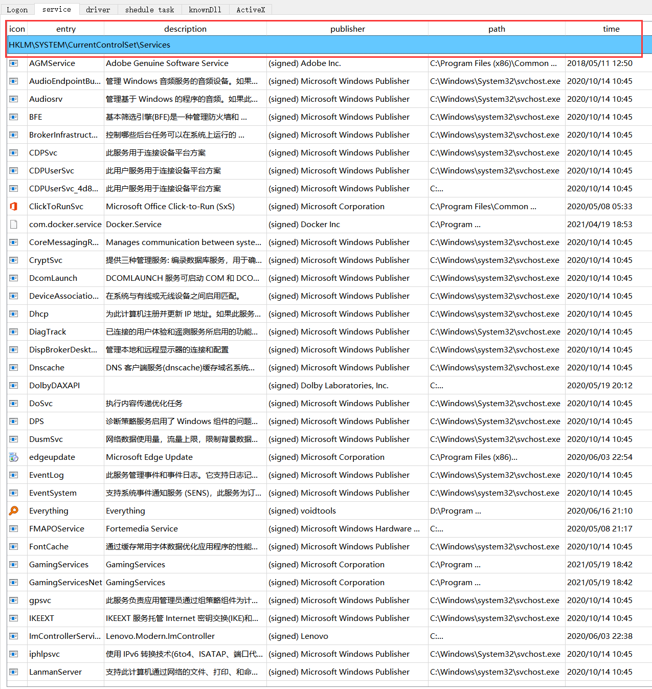

## Windows自启动项的查看和分析

### 作业内容

1. 结合课堂所讲授的内容，围绕着“Windows 自启动项的查看和分析”主题，查阅课外资料，编写验证代码，动手进行实验，撰写一份技术研究和设计开发报告，要求有一定深度的分析和实践步骤，主题明确，条理清晰，文字流畅，图文并茂，字数不限。此外，还需一并附上可执行软件和源代码。
2. 可以参考 `SysinternalsSuite `工具集中的 `Autoruns `软件，了解在 Windows系统中有哪些可以实现自启动的技术方法，然后分析它们各自的技术原理、实现细节和隐蔽性状况，撰写到课程报告之中。
3. 编写自己的 Windows 自启动项查看软件。

### Windows 自启动项分析

#### 前置说明

Windows 自启动项，从字面上很容易理解，就是在Windows操作系统中能够自发运行的一些程序或者任务，用户不必单独去运行命令进行启动，使得操作系统更具人性化。但是也应看到的是自启动项也有很多的弊端，比如被恶意程序利用，浪费大量的计算资源，进行恶意操作，或者拖慢了电脑的启动时间，给用户非常不好的体验。有必要让用户直观的看到计算机中的自启动项，以便用户对电脑进行及时的优化和处理。

由于Windows操作系统的复杂性以及需要适用不同的功能需求，Windows操作系统可以通过多种方式进行自启动，课程指导书中已经列举出一部分实现自启动的技术方法。由于时间有限，精力有限，我此次作业主要对Logon（基于启动目录和基于注册表）、Services（系统服务）、Drivers（系统驱动服务）、Schedule Tasks（计划启动任务）、Known DLLs（基于知名动态链接库）、ActiveX（附加程序）六种基本的启动技术方法加以分析和代码实践。

微软官方也提供了大量的API接口，让编程人员可以较为方便的读取计算机中的自启动项内容，可以在MSDN官方文档进行查阅，同时微软提供了大量的样例代码。

#### 基于注册表

##### 注册表介绍

**注册表**(Registry)是Windows操作系统的一大特色，它实质上是一个庞大的数据库，它存储着下面这些内容：用户计算机软、硬件的有关配置和状态信息，应用程序和资源管理器外壳的初始条件、首选项和卸载数据；计算机的整个系统的设置和各种许可，文件扩展名与应用程序的关联，硬件的描述、状态和属性；计算机性能记录和底层的系统状态信息，以及各类其他数据。

##### 分析

通过基于注册表实现的自启动项是用户能感知到的启动项中最多的一部分。由于微软给了很多的底层函数用来操作注册表以达到不同的效果，导致此处也成为恶意代码编写人员关注的重要位置。 

通过课程理论与网上资料可以得知自启动项的注册位置主要位于`HKEY_CURRENT_USER（HKCU）` 和 `HKEY_LOCAL_MACHINE（HKLM）` 两类根键下。为便于实现以及减少工作量，本次的代码实践也仅查看了这两类根键之下的启动项注册内容。两类自启动项的区别主要在于写入的自启动项注册表项生效时间、写入权限以及64位操作系统的重定向问题。 当注册表路径含有 HKLM时，说明该注册表表项会在计算机启动时生效，且只有管理员以上权限能够写入。注册表路径含有 HKCU 时，是在用户登录时生效，当前用户能够写入和修改。在64位系统下，系统注册表会重定位。`HKEY_LOCAL_MACHINE\Software\Microsoft\Windows\CurrentVersion\Run`                                                                                         重定向到`HKEY_LOCAL_MACHINE\Software\WOW6432Node\Microsoft\Windows\CurrentVersion\Run`

本次代码实践中使用到以下注册表路径的读取以呈现相关的自启动项：

```
"HKEY_LOCAL_MACHINE\\SOFTWARE\\Microsoft\\Windows\\CurrentVersion\\Run"
"HKEY_LOCAL_MACHINE\\SOFTWARE\\Microsoft\\Windows\\CurrentVersion\\Policies\\Explorer\\Run"
"HKEY_LOCAL_MACHINE\\SOFTWARE\\Microsoft\\Windows\\CurrentVersion\\RunOnce"
"HKEY_LOCAL_MACHINE\\SOFTWARE\\Microsoft\\Windows\\CurrentVersion\\RunOnceEx"
"HKEY_CURRENT_USER\\SOFTWARE\\Microsoft\\Windows\\CurrentVersion\\Run"
"HKEY_CURRENT_USER\\SOFTWARE\\Microsoft\\Windows\\CurrentVersion\\Policies\\Explorer\\Run"
"HKEY_CURRENT_USER\\SOFTWARE\\Microsoft\\Windows\\CurrentVersion\\RunOnce"
"HKEY_CURRENT_USER\\SOFTWARE\\Microsoft\\Windows\\CurrentVersion\\RunOnceEx"
```

##### 具体注册表路径分析

- `~\\\\RunOnce`：在计算机运行命令行之前会删除 `RunOnce `键的值，若在安全模式下启动，`RunOnce `键将被忽略。
- `~\\\\RunOnceEx` ：只在第一次登录后被` Explorer shell` 运行一次，将在处理后从注册表中删除，不再运行。`RunOnceEx `注册表项不会创建单独的进程。


上图是我电脑中`HKLM`根键下的`Run`中的注册表项，可以清晰地看到，Run的注册表值信息包括启动项名称、类型、相关的`ImagePath`。

#### 基于启动目录

启动目录，顾名思义，用户只需要将需要开机启动的文件或者快捷方式放在这里，即可在系统启动时加载运行。目前`Windows Vista`版本之后的Windows操作系统的启动目录都为以下两个：

```
"%USERPROFILE%\AppData\Roaming\Microsoft\Windows\Start Menu\Programs\Startup"
"C:\ProgramData\Microsoft\Windows\Start Menu\Programs\Startup
```

两者的区别在于权限的不同以及生效时间的不同。前者为当前用户配置目录，须具有相应用户权限，生效的时间为相应用户登录时，后者是系统启动目录，须具有管理员以上权限方可更改，任意用户登录都可生效。  

#### 基于服务程序

##### 技术与概念分析

- 服务程序是后台运行的进程，常用来执行特定的任务，不需要和用户进行交互。如自动更新服务、后台智能传输服务、事件日志服务等。
- 服务程序受`Service Control Manager`（SCM，即services.exe进程）所控制。
- 服务程序的配置数据位于`HKLM\System\CurrentControlSet\Services`
- 服务程序的种类（Type）
  - 内核驱动（Kernel drivers）服务
  - 独立进程（Separate process）服务
  - 共享进程（Shared process）服务
- 服务的启动类型（Start）
  - 自动（Auto）
  - 手动（Demand）
  - 禁用（Disable）
- 服务的基本信息
  - 显示名称（DisplayName）
  - 服务描述（Description）
  - 可执行文件路径（ImagePath）
  - 登录身份账户（ObjectName）
-  通过以上说明，可以看到基于驱动程序的自启动项也在这里进行配置，只是`Type`不同，其中 1、2、8为驱动，16、32、256为服务。
- `Start`值得不同决定了该注册表项代表得服务或者驱动是否自启动，其中`Start`等于0、1、2时均为自启动，3时为手动启动，4为禁用，所以在进行基于服务和驱动程序得自启动项展示时，需要考虑这一因素，并进行过滤。
- `svchost`共享服务的可执行文件路径需要获取到真正实现服务功能的dll文件
  - svchost.exe是微软Windows操作系统中的系统文件，微软官方对它的解释是：svchost.exe 是从动态链接库 (DLL) 中运行的服务的通用主机进程名称。这个程序对系统的正常运行是非常重要，而且是不能被结束的。许多服务通过注入到该程序中启动，所以会有多个该文件的进程。
  - 如果自启动项的imagePath是svchost的路径，那么这个自启动项会借助svchost实现自启动，则需要进一步读取子健“Parameters”中的`ServiceDll`注册表项，提取真正的路径信息作为imagePath；
  - 这一点是补充点，函数读取函数位于regread头文件中。
  - 本机实例：
  - 
  - 
- 其他的注册表键值可见课件上的两张图，写得很详细：


##### 本机实例


#### 基于系统驱动

与前一部分“基于服务得自启动项分析”是一样的，其区别也在前文中有叙述，可以认为`Type`的值小于16的自启动项即为驱动程序，且需要注意得到得`Start`的值。

#### 基于计划启动任务

##### 计划启动任务简介

- 通过计划启动任务，用户可以设置触发条件或者定时让操作系统运行某个程序。计划任务程序会监控相应的条件，在触发时执行相应的操作。
- 查找相关资料得知，计划启动任务的自启动项可以在特定目录——`C:\\Windows\System32\Tasks`中进行查看。
- 计划任务的自启动项的相关信息被保存为相应的`xml`格式，需要使用特定的`API`函数进行查看，或者自己进行简单解析。

##### 本机实例

文件夹内容查看


启动项`xml`信息查看，在此处可以看到许多信息，其中需要得到的信息为`Actions`标签中的`Command`标签项。


#### 基于动态链接库

##### 简介

`Known DLLs `是知名动态链接库 ，它是 `Windows NT`中的一种机制，允许系统默认自启动常用的系统dll。KnownDlls绝对路径是在系统目录中，在系统启动的时候，从注册表读取`Known Dlls`键值对，之后，如果有程序加载这个dll，首先要搜索系统目录，其次搜索当前目录。

所有的`Known DLLs`键值对位于注册表的`HKEY_LOCAL_MACHINE\System\\CurrentControlSet\\Control\\Session
Manager\\KnownDlls  `这个位置，系统启动后会对这个位置进行遍历。

在注册表项中没有列举出每一个dll的具体路径，因为所有的知名链接库都放在了系统默认的目录——"C:\\Windows\\system32\\"中，有效防止了病毒伪装的马甲dll的加载。因此在读取所有的知名动态链接库列表后，只需要在该目录下寻找，即可得到绝对路径，进而获取相关的信息。

##### 本机实例


#### 基于ActiveX

`ActiveX` 控件是` Internet Explorer` 的一类小程序，通常称为附加程序。 该启动项路径可以在注册表中查看，注册表位置为“HKLM\SOFTWARE\Microsoft\Active Setup\Installed Components\\{GUID} ”，每一个`GUID`代表一个新的插件，GUID中的键值项中的`StubPath`就是该启动项的路径。

### 部分API简述

#### 注册表相关

##### RegOpenKeyExA()

- 参数

  ```c++
  LSTATUS  RegOpenKeyExA(
    HKEY   hKey,  
    LPCSTR lpSubKey,
    DWORD  ulOptions,
    REGSAM samDesired,
    PHKEY  phkResult
  );
  ```

- 用途：用于打开指定的注册表位置，`hKey`为根键，`lpSubKey`为需要打开的路径，`ulOptions`为特定选项，一般置零，`samDesired`为权限参数，`phkResult`为返回的句柄，指向已打开的键。

##### RegQueryInfoKey()

- 参数

  ```
  LSTATUS RegQueryInfoKeyW(
    HKEY      hKey,
    LPWSTR    lpClass,
    LPDWORD   lpcchClass,
    LPDWORD   lpReserved,
    LPDWORD   lpcSubKeys,
    LPDWORD   lpcbMaxSubKeyLen,
    LPDWORD   lpcbMaxClassLen,
    LPDWORD   lpcValues,
    LPDWORD   lpcbMaxValueNameLen,
    LPDWORD   lpcbMaxValueLen,
    LPDWORD   lpcbSecurityDescriptor,
    PFILETIME lpftLastWriteTime
  );
  ```

- 用途：此函数用于检索指定注册表项的信息，且此函数必须在打开注册表位置获取句柄后使用。

##### RegEnumKeyEx()

- 用途：枚举指定的打开注册表项的子项。 每次调用该函数时都会检索有关一个子项的信息

##### RegEnumValue()

- 参数

  ```c++
  LSTATUS RegEnumValue(
    HKEY    hKey,
    DWORD   dwIndex,
    LPSTR   lpValueName,
    LPDWORD lpcchValueName,
    LPDWORD lpReserved,
    LPDWORD lpType,
    LPBYTE  lpData,
    LPDWORD lpcbData
  );
  ```

- 用途：枚举指定的打开注册表项的值。 每次调用该函数时，该函数都会为该键复制一个索引值名称和数据块。

##### RegQueryValueExA()

- 参数

  ```
  LSTATUS RegQueryValueExA(
    HKEY    hKey,
    LPCSTR  lpValueName,
    LPDWORD lpReserved,
    LPDWORD lpType,
    LPBYTE  lpData,
    LPDWORD lpcbData
  );
  ```

- 用途：检索与打开的注册表项关联的指定值名称的类型和数据。

- 在基于`serivces`以及`driver`自启动中，使用这个函数读取`Type、Start、ImagePath、Description`是非常方便的。

- 可以参考https://www.cnblogs.com/csuftzzk/p/RegQueryValueEx_Usage.html这篇博客。

#### COM服务相关

##### CoInitializeEx()

- 用途：初始化提供线程使用的`COM`库。

##### CoInitializeSecurity()  

- 用途：注册安全性，设置安全值

##### CoCreateInstance() 

- 用途：用于创建与指定的`CLSID`相关联的对象，使传入的句柄指向请求的接口指针变量的地址。

#### 计划任务读取相关

##### ITaskFolder  

提供用于在文件夹中注册（创建）任务、从文件夹中删除任务以及从文件夹中创建或删除子文件夹的方法。

常用方法：

| 方法 | 作用 |
| ---- | ---- |
| ITaskFolder::CreateFolder | Creates a folder for related tasks. |
| ITaskFolder::get_Name | Gets the name that is used to identify the folder that contains a task. |
| ITaskFolder::DeleteFolder | Deletes a subfolder from the parent folder. |
| ITaskFolder::GetTasks | Gets all the tasks in the folder. |
| ITaskFolder::DeleteTask | Deletes a task from the folder. |
| ITaskFolder::get_Path | Gets the path to where the folder is stored. |
| ITaskFolder::GetFolders | Gets all the subfolders in the folder. |
| ITaskFolder::GetFolder | Gets a folder that contains tasks at a specified location. |
##### IRegisteredTask

提供用于立即运行任务、获取任务的任何运行实例、获取或设置用于注册任务的凭据以及描述任务的属性的方法。

常用方法：
| 方法 | 作用 |
| ------------------------------------------------------------ |
| IRegisteredTask::get_Definition | Gets the definition of the task. |
| IRegisteredTask::get_Enabled |   Gets or sets a Boolean value that indicates if the registered task is enabled. |
| IRegisteredTask::get_LastRunTime | Gets the time the registered task was last run. |
| [IRegisteredTask::get_LastTaskResult |  Gets the results that were returned the last time the registered task was run. |
| IRegisteredTask::get_Name | Gets the name of the registered task. |
| IRegisteredTask::get_NextRunTime |  Gets the time when the registered task is next scheduled to run. |
| IRegisteredTask::get_NumberOfMissedRuns |  Gets the number of times the registered task has missed a scheduled run. |
| IRegisteredTask::get_Path | Gets the path to where the registered task is stored. |
| IRegisteredTask::get_State |  Gets the operational state of the registered task. |
| IRegisteredTask::get_Xml |  Gets the XML-formatted registration information for the registered task. |


##### ITaskService  

此对象提供对计划任务服务的访问权限，初始化指向计划任务根文件夹的句柄。

##### ITaskFolderCollection  

顾名思义，计划任务文件夹集合，拥有多种对文件夹信息的操作方法。

#### 证书与验证相关

##### CryptQueryObject()

`CryptQueryObject `函数检索有关加密 `API `对象内容的信息，例如证书、证书吊销列表或证书信任列表。 对象可以驻留在内存中的结构中，也可以包含在文件中。

##### CryptMsgGetParam()

##### CertFindCertificateInStore()

##### CryptDecodeObject()

##### WinVerifyTrust()

上述几项`API`函数均与文件的证书与验证证书相关，微软官方给出了使用示例程序。

#### 文件信息相关

##### GetFileVersionInfoSize()

- 参数

  ```c++
  DWORD GetFileVersionInfoSize (LPTSTR lptstrFilename，
      LPDWORD lpdwHandle
  );
  ```

- 用途：函数确定操作系统是否可以检索指定文件的版本信息。如果版本信息可用，GetFileVersionInfoSize返回该信息的大小（以字节为单位）。


##### GetFileVersionInfo()

- 参数

  ```c++
  BOOL GetFileVersionInfo(
    LPCSTR lptstrFilename,
    DWORD  dwHandle,
    DWORD  dwLen,
    LPVOID lpData
  );
  ```

- 用途：用来获取包含在指定文件中的版本信息。


##### VerQueryValue()

- 参数

  ```c++
  BOOL VerQueryValue(
    LPCVOID pBlock,
    LPCSTR  lpSubBlock,
    LPVOID  *lplpBuffer,
    PUINT   puLen
  );
  ```

- 用途

  - 用来从指定的版本信息资源中获取指定版本信息
  - 常用的获取版本信息的逻辑流程是：先调用`GetFileVersionInfoSize`函数，紧接着再调用`GetFileVersionInfo`函数，最后再调用`VerQueryValue`函数。

#### 获取计算机特殊路径

##### SHGetKnownFolderPath()

- 参数

  ```c++
  HRESULT SHGetKnownFolderPath(
    REFKNOWNFOLDERID rfid,
    DWORD            dwFlags,
    HANDLE           hToken,
    PWSTR            *ppszPath
  );
  ```

- 用途：检索由文件夹的 `KNOWNFOLDERID` 标识的已知文件夹的完整路径。

- 使用方式：

  ```c++
  	PWSTR common_path ;
  	SHGetKnownFolderPath(FOLDERID_CommonStartup,NULL,NULL,&common_path);
  ```

##### KNOWNFOLDERID

`KNOWNFOLDERID` 常量表示将在系统中注册的标准文件夹标识为已知文件夹的 GUID。 这些文件夹随 Windows Vista 和更高版本的操作系统一起安装，并且计算机将仅安装适合它的文件夹。 

其中，用户的自启动目录和系统的自启动目录常量为：`FOLDERID_Startup、FOLDERID_CommonStartup`

#### QT相关

##### QFileInfo::created()

用于获取文件的创建时间

##### QFileIconProvider::icon()

用于获取文件的图标信息

##### QFileInfo::canonicalFilePath()

如果文件是一个快捷方式，使用此函数可以获取文件的绝对路径

### 设计&实现

#### 开发环境

|     OS     | Windows10 家庭中文版 |
| :--------: | :------------------: |
|   QT版本   |        5.15.2        |
| 编译器版本 |     msvc2019_64      |
|  编程语言  |         C++          |

#### 源码结构说明

|  头文件    |  作用    |
| :--: | :--: |
| regread.h | 所有读注册表相关的函数 |
| readTask.h | 读取计划任务相关的函数与读取启动目录相关函数 |
| mainwindow.h | 定义窗口、槽函数 |
| description.h | 读取文件描述 |
| signature.h | 读取证书发行方与验证签名 |
| convert.h | 转换各种不同类型数据所用函数 |

|  源文件    |  作用    |
| :--: | ---- |
| main.cpp | 入口main函数 |
| mainwindow.cpp | 定义ui逻辑，填充界面，所有函数均在此处进行集成与调用 |

#### 功能设计

##### 流程

虽然各个自启动项所在位置不同，读取方法不同，但是读出来的数据都包含自启动项的名称和启动路径，然后再根据启动路径获取相应的描述，以及验证该启动项的签名以及证书。

##### 读取注册表相关（包含service、driver、knowndll、ActiveX）

- 读取注册表指定路径的键值信息

  - 这一部分主要用于基于注册表进行启动的功能、基于`knowndll`中，因为基于注册表进行启动的注册表项仅有一系列键值对，没有子键等信息。
  - 先使用`RegOpenKeyExA`获取句柄，再调用`RegQueryInfoKey`获取最大子键的`size`、注册表项个数等信息，再调用`RegEnumValue`逐一获取键值对，保存在`map`中。

-  读取注册表子键名

  - 这一部分应用于基于`service、driver、ActiveX`的自启动项读取过程中，与基于注册表进行启动的注册表项不同，此处的自启动项都各自拥有一个子健和子健的众多描述键值对。
  - 先使用`RegOpenKeyExA`获取句柄，再调用`RegQueryInfoKey`获取最大子键名的`size`、子健的个数等信息，再调用`RegEnumKeyEx`逐一获取子健的名称，写入到`map`中

-  读取子健中的特定描述信息

  - 主要应用于之前读取子健名的各个过程中，读取特定的信息，比如`ImagePath、Type、StubPath、Description`等等

  - 先使用`RegOpenKeyEx`获取注册表对应路径的句柄，调用`RegQueryValueEx`函数，获取相应信息的值。见于下面的代码：

  - ```c++
    string read_imagepath(HKEY aim_rootkey, LPCWSTR key_data)
    {
        HKEY cpp_key;
        DWORD dwtype = 0;
        TCHAR lpvalue[MAX_VALUE_NAME];
        DWORD dwsize = 0;
    
        long ret;
        ret = RegOpenKeyEx(aim_rootkey, key_data, 0, KEY_READ, &cpp_key);
        if (ret == ERROR_SUCCESS)
        {
            ret = RegQueryValueEx(cpp_key, _T("ImagePath"), 0, &dwtype, (LPBYTE)lpvalue, &dwsize);
            RegCloseKey(cpp_key);
        }
        char *tmp1 = TCHAR2char(lpvalue);
        string tmp2 = tmp1;
        delete [] tmp1;
        tmp1 = NULL;
        return tmp2;
    }
    ```

##### 基于启动目录&文件操作

- 获取计算机的自启动目录绝对路径
  - 由之前介绍的`Windows API`获取计算机的两个自启动目录绝对路径；
- 获取基于自启动目录的自启动项
  - 借助`Windows`的`_finddata_t`文件数据结构，结合`_findfirst`和`_findnext`两个主要函数，对自启动目录下的所有文件进行枚举。
  - 对返回的数据进行甄别，如果是快捷方式（lnk），则利用`QFileInfo::canonicalFilePath()`获取到绝对路径，作为此自启动项的`ImagePath`路径。

##### 读取计划任务相关

- 获取读计划任务的相应权限

  - 使用前文中叙述的`COM`相关的`API`，使用官方提供的`ITaskService`进行权限的获取，连接到计划任务根文件夹`ITaskFolder`，此根文件夹`ITaskFolder`用于之后的递归入口。

- 递归读取各个计划任务的具体信息，包括启动路径以及所在计划任务文件夹中的相对路径

  - 递归函数：`BOOL readAllTask(ITaskFolder* pRootFolder, HRESULT hr, BSTR allfolderName, map<string,string>* taskMap);`

  - 在递归函数中，先获取所有计划任务的相关信息，再获取计划任务子文件夹，对每一个子文件夹继续递归。

  - 通过`IRegisteredTaskCollection`依次获取`IRegisteredTask`，利用该对象的`get_Definition`获取`ITaskDefinition`对象，然后`get_Actions`获取`IActionCollection`，然后`get_Item`获取`IAction`对象，然后`QueryInterface`获取`IExecAction`对象，`get_State`判断此计划任务的状态，`IExecAction::get_Path`获取最终的执行路径，添加到`map`中。


```c++
IRegisteredTaskCollection* pTaskCollection = NULL;
    hr = pRootFolder->GetTasks(NULL, &pTaskCollection);
    if (SUCCEEDED(hr)) {
        LONG numTask = 0;
        pTaskCollection->get_Count(&numTask);
        for (LONG i = 0;i<numTask; i++) {
            IRegisteredTask* pTask = NULL;
            hr = pTaskCollection->get_Item(_variant_t(i + 1), &pTask);
            if(SUCCEEDED(hr)) {
                BSTR taskName = NULL;
                hr = pTask->get_Name(&taskName);
                if (SUCCEEDED(hr)) {
                    ITaskDefinition* taskDefination = NULL;
                    IActionCollection* actionCollection = NULL;
                    IAction* action = NULL;
                    IExecAction* execAction = NULL;
                    BSTR pPath = NULL;
                    BSTR mImagePath = NULL;
                    hr = pTask->get_Definition(&taskDefination);
                    if (SUCCEEDED(hr)) {
                        hr = taskDefination->get_Actions(&actionCollection);
                        if(SUCCEEDED(hr)) {
                            hr = actionCollection->get_Item(1, &action);
                            if (SUCCEEDED(hr)) {
                                 hr = action->QueryInterface(IID_IExecAction, (void**)&execAction);
                                 TASK_STATE taskState;
                                 pTask->get_State(&taskState);
                                 bool disabled = (taskState == TASK_STATE_DISABLED);
                                 bool queued = (taskState == TASK_STATE_QUEUED);
                                 bool ready = (taskState == TASK_STATE_READY);
                                 bool running = (taskState == TASK_STATE_RUNNING);
                                 bool unknown = (taskState == TASK_STATE_UNKNOWN);
                                 if (ready || running || queued) {
                                     if (SUCCEEDED(hr)) {
                                         hr = execAction->get_Path(&mImagePath);
                                         if (SUCCEEDED(hr)) {
                                             string m_floder_name = _com_util::ConvertBSTRToString(allfolderName);
                                             string m_task_name = _com_util::ConvertBSTRToString(taskName);
                                             string imagePath = _com_util::ConvertBSTRToString(mImagePath);
                                             string m_left_key = m_floder_name+m_task_name;
                                             hr = pTask->get_Path(&pPath);
                                             if (SUCCEEDED(hr)) {
                                                 string m1_left_key = _com_util::ConvertBSTRToString(pPath);
                                                 taskMap->insert(make_pair(m1_left_key,imagePath));
                                             }
                                             execAction->Release();
                                         }
                                         action->Release();
                                     }
                                 }
                                 actionCollection->Release();
                            }
                            taskDefination->Release();
                        }
                    }
                    SysFreeString(taskName);
                    pTask->Release();
                }
            }
        }
        pTaskCollection->Release();
    }
```

##### 根据路径获取证书以及验证签名等信息

- 判断签名信息
  - 主要利用了官方提供的`WINTRUST_FILE_INFO`数据结构，结合`WinVerifyTrust()`函数，对签名信息进行验证，从而判断是否被验证签名。
- 获取证书发行方
  - 在本次设计中被包装成`GetSignaturePublisher()`函数，依次调用`CryptQueryObject、CryptMsgGetParam、CryptDecodeObject、CertFindCertificateInStore、CertGetNameString`等函数，套用`MSDN`上的模板，获取`publisher`。
- 获取文件时间戳
  - 使用QT提供的函数`QFileInfo::created()`获取文件的时间戳信息。

### 效果展示与分析

在设计与实现模块已经对很多功能的技术实现做了说明，本部分仅对QT界面部分与调用并集成进行说明。

1. Logon

   分为两部分：基于注册表和基于启动目录。分别调用不同的函数，可以得到相应的`map<string,string>`结构，`key`对应`entry`，`value`对应`ImagePath`，然后依据`ImagePath`进行证书的获取、签名的验证、时间戳获取等操作。最终进行每一行的填充。

   效果如下图：

   

2. Services

   基于特定注册表的子键，需要先调用`read_subkey()`函数读取子键合集，然后对每一个子键进行特定描述信息的读取，比如`Type、Start、ImagePath、Description`的读取。值得注意的是要对`Type`进行划分，以及通过`Start`判断是否是自启动，进行过滤。然后像上一步一样通过`ImagePath`对每一行进行填充。通过使用string中的contains函数判断是否依赖于svchost进行启动。

   **补充：在上文service自启动项的分析中，我提到如果该service借助svchost进程实现自启动，则需要进一步读取子健“Parameters”中的`ServiceDll`注册表项，以获取真实服务的路径信息。**

   **重新整理之后的效果如下：**

   

   之前的效果如下：

   

3. Drivers

   几乎与上一步一模一样，仅在于`Type`的不同。

   效果如下图：

   

4. Shedule Tasks

   基于特定计划任务文件夹的自启动项读取。由于在上文中的递归函数中已经传入了`map<string,string>`指针，`map`中的`value`存储`imagepath`，接下来的步骤同上述几个步骤相似，对每一行进行填充。

   效果如下图：

   

5. Known DLLs

   基于特定注册表路径的启动项读取。由于所有的`knowndll`名称位于同一个文件夹，所以调用读取注册表键值对的函数后，只需要在`value`项的前面加上绝对目录前缀即可得到各个启动项的绝对路径，也就是`ImagePath`值，其余步骤与上文中叙述相似。

   效果如下图：

   

6. ActiveX

   此项的读取与`service、driver`步骤相似，先先调用`read_subkey()`函数读取子键`GUID`合集，然后对每一个子键进行特定描述的读取，其中读取`Localized Name`或者`ComponentID`的值作为该启动项的entry名称，读取`StubPath`的值作为启动项的`ImagePath`。读取出`ImagePath`后就与上述步骤相似了，填充每一行即可。

   需要注意的是对空值的判断，有很多注册表项是空的，或者仅满足一项条件，需要进行过滤。

   效果如下图：

   

### 困难&收获&感想

#### 困难

在此总结出一些我在做作业过程中遇到的问题。

- 字符串转换问题

  - 这个问题从始至终都在遇到，毫无他法，遇到一个解决一个就可以。
  - 里面出现的字符串大致有两种：`char和w_char`。
  - 又有许多不同的包装类型：`LPTSTR、LPCTSTR、LPCWSTR、LPBYTE、TCHAR、BSTR、WCHAR、QString`等等
  - 我目前的解决方法是包装多个转换函数，遇到一个转换一个，在宽字符与单字节字符之间的转换需要用到`WideCharToMultiByte`和`MultiByteToWideChar`两个函数。
  - 我主要使用标准库中的string类型在各种函数之中转换，在后期减少了我很多麻烦

- 程序异常&heap溢出

  - 大概率是内存泄漏，前期刚写作业时，用到了大量的char *指针，很有可能导致了野指针以及释放不及时等问题，令人头疼，第一次体会到指针也不是太好用。
  - 后来几乎全面转向string类型，就没有出现这个情况了。

- 链接库问题

  - 一开始运行的时候，总是报错显示“无法解析的外部符号` __imp_CryptDecodeObject` ”这种问题，被折磨了好久，被同学提醒需要在变异的时候加上一些libs。

  - ```
    LIBS += \
            -ladvapi32 \
            -lkernel32 \
            -luser32 \
            -lgdi32 \
            -lcrypt32 \
            -lwintrust \
            -ltaskschd \
            -lcomsupp \
            -lshlwapi
    ```

- 计划任务读取报错

  - FTH: (4672): *** Fault tolerant heap shim applied to current process. This is usually due to previous crashes. **
  - 后来查到原来是在递归的时候提早把一个指针无意中给释放了，导致了野指针，从而报错，这个也会导致程序异常。

- exe运行报错问题

  - QT直接执行exe时显示无法定位程序输入点`eventFilter@QAbstractItemView@@MEAA_NPEAVQObject@@PEAVQEvent@@@`于动态链接库
  - 原因是exe运行时找不到相应的依赖dll位置，有两种情况会导致其出现
    - 系统中多个编译器版本，且在path中都有定义，这样exe第一个找到的dll不符合其要求
    - 环境变量path中没有添加编译器相应的路径
  - 解决方法也有两种
    - 添加编译器bin路径到环境变量path中，越靠前越好
    - 使用QT自带的`windeployqt`工具对所需的dll进行抽取，这样exe会寻找本地目录下的dll进行加载。

#### 收获

- 我上一次使用c++应该还是学习数据结构时，所以写完这个程序后感知最明显的是c++更熟悉了，对标准库中的类型使用更加熟练，对于指针也有了更深入的理解。
- 本次程序编写属于Windows编程，运行在Windows平台上，用到了很多Windows32的API，因此需要阅读大量MSDN上面的官方文档以及相关的博客文章进行API的了解与学习。这些工作使我对Windows自启动项的技术原理、管理使用有更加深入的理解，尤其是对注册表的理解更深了，以前没有接触过注册表。也大致对Windows编程的基本过程更熟悉了。
- 由于需要编写一个图形界面，我使用了`QTWidget`进行实现，由于这次的重点不在图像界面上，我在图形界面中仅使用了一个`TabWiget`作为容器。虽然工作量很少，但是对QT搭建图形界面的基本结构和运行过程有了一定了解。
- 提高了我信息检索与解决问题的能力。在整个作业过程中，我遇到了很多问题，有简单的也有复杂的。以前遇到问题只知道去网上查，现在我能更加熟练的使用断点debug，判断问题出处，然后考虑解决方法，能更精准地解决问题，大大提高了解决问题的效率。
